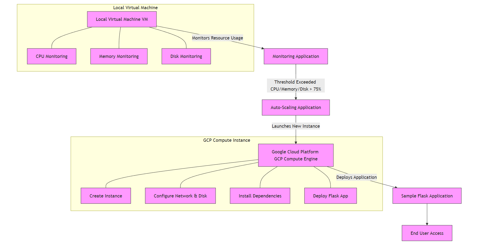

# Auto-Scaling Mechanism for Local VM to Public Cloud  

## Objective  
The goal of this project is to implement an auto-scaling mechanism that automatically scales from a local virtual machine (VM) to a Google Cloud Platform (GCP) instance when resource usage exceeds predefined thresholds. This ensures high availability and better performance during high traffic or heavy load conditions.  

## Features  
✅ Monitors CPU, memory, and disk usage in real-time.  
✅ Automatically launches a GCP instance when resource usage exceeds defined thresholds.  
✅ Deploys a sample Flask application on both the local VM and the cloud instance.  
✅ Seamless transition between local and cloud environments.  

---

## Setup Instructions  

### **Prerequisites**  
Ensure the following dependencies are installed and configured before proceeding:  
- Python 3.x installed on your system.  
- GCP service account credentials (JSON file) with necessary permissions to create and manage VM instances.  

---

### **1. Clone the Repository**  
Clone the project from the GitHub repository:  
```bash
git clone https://github.com/mrpritesh45/Auto-Scaling-Mechanism-from-Local-VM-to-Public-Cloud.git
cd auto-scale-project
```

---

### **2. Set Up the Virtual Environment**  
Create and activate a virtual environment:  
```bash
python3 -m venv venv
source venv/bin/activate
pip install -r sample-app/requirements.txt
```

---

### **3. Run the Flask App Locally**  
Navigate to the sample app directory and start the Flask app:  
```bash
python sample-app/app.py
```
- The app will be available at `http://localhost:5000`  

---

### **4. Configure GCP Credentials**  
Set up the GCP credentials:  
```bash
export GOOGLE_APPLICATION_CREDENTIALS="path/to/your-service-account.json"
```

---

### **5. Run the Auto-Scaling Script**  
Execute the auto-scaling script to monitor resources and scale automatically:  
```bash
python autoscale.py
```

- The script will monitor the CPU, memory, and disk usage in real-time.  
- When resource usage exceeds the predefined thresholds, the script will launch a new GCP instance and deploy the Flask app.  

---

## Thresholds and Scaling Logic  
| Metric | Threshold | Action |  
|--------|-----------|--------|  
| **CPU Usage** | > 75% | Launch new GCP instance |  
| **Memory Usage** | > 75% | Launch new GCP instance |  
| **Disk Usage** | > 75% | Launch new GCP instance |  

---

## **Architecture Diagram**  
  

- **Local VM** – Runs the Flask app and monitors resources.  
- **Cloud Instance** – A new instance is created when local VM resources exceed the thresholds.  
- **Load Balancer** (Optional) – Can be added to distribute traffic between local and cloud instances.  

---

## **File Structure**  
```
auto-scale-project/  
├── sample-app/
│   ├── template/
│   │  ├── index.html    
│   ├── app.py  
│   ├── requirements.txt  
├── autoscale.py  
├── README.md  
├── architecture.png
```
